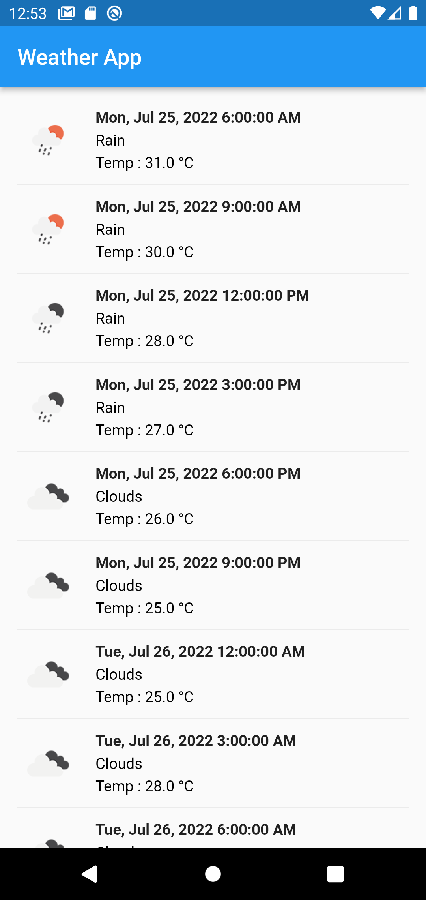

# flutter_weather_delos

A new Flutter project For Testing Delos, testing success on Android and IOS


## Screnshoot

### IOS


### Andorid



## Getting Started

This project is a starting point for a Flutter application.

A few resources to get you started if this is your first Flutter project:

- [Lab: Write your first Flutter app](https://docs.flutter.dev/get-started/codelab)
- [Cookbook: Useful Flutter samples](https://docs.flutter.dev/cookbook)

For help getting started with Flutter development, view the
[online documentation](https://docs.flutter.dev/), which offers tutorials,
samples, guidance on mobile development, and a full API reference.


## Flutter Verison
Doctor summary (to see all details, run flutter doctor -v):
[✓] Flutter (Channel stable, 3.0.4, on macOS 12.4 21F79 darwin-arm, locale en-ID)
[✓] Android toolchain - develop for Android devices (Android SDK version 32.0.0)
[✓] Xcode - develop for iOS and macOS (Xcode 13.4.1)
[✓] Chrome - develop for the web
[✓] Android Studio (version 2021.1)
[✓] IntelliJ IDEA Ultimate Edition (version 2021.3.1)
[✓] VS Code (version 1.69.2)
[✓] Connected device (3 available)
[✓] HTTP Host Availability


## State Management
i'm using Provider 


## Flutter for Apple M1 Users

Inside your _iOS Folder_ follow these commands in terminal:

```
$ sudo arch -x86_64 gem install ffi
$ arch -x86_64 pod install
```

If doesn't work try this:

```
$ arch -x86_64 pod install --repo-update
```


## Running The App

To launch the app in the Simulator, ensure that the Simulator is running and enter the following command from the root of the project in the terminal:

```
$ flutter pub get
$ flutter run 

e.g.
$ flutter run 
```


## Run Tests Using VSCode

The Flutter plugins for VSCode support running tests. This is often the best option while writing tests because it provides the fastest feedback loop as well as the ability to set breakpoints.

1. Select the Debug menu
2. Click the Start Debugging option


## External Package 
  provider: ^6.0.2
  dio: ^4.0.4
  dartz: ^0.10.1
  collection: ^1.16.0
  intl:

